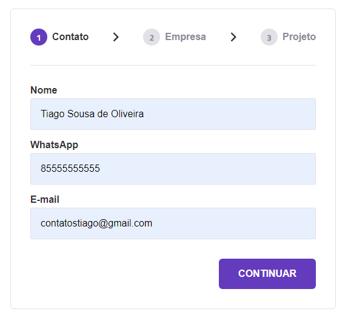

# Formulário Multi-Step

Formulário dividido para o usuário preencher seguindo um passo a passo. Esse tipo de formulário deixa o site mais personalizado e ainda melhora a experiência de usuário, pois ao dividir o formulário em etapas, fica menos cansativo o preenchimento.

## Tecnologias utilizadas

<ul>
<li>HTML</li>
<li>CSS</li>
<li>JAVASCRIPT</li>
</ul>